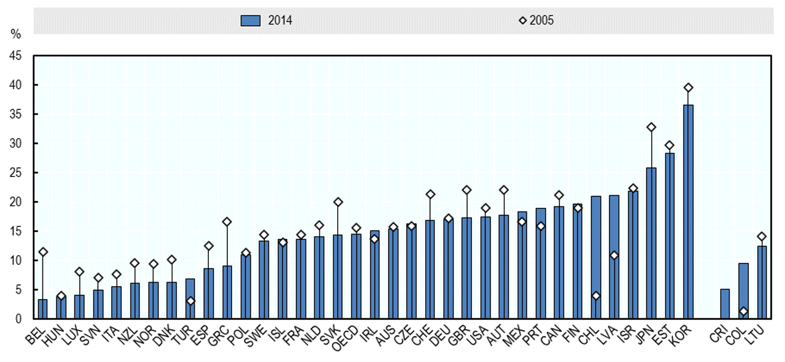

```{r setup, include=FALSE}
knitr::opts_chunk$set(echo = TRUE)
```

## Example OECD chart {#example}

A good way to familiarise yourself with R is by recreating charts that you may otherwise make in Excel. In the spirit of gender month at the OECD, I have chosen a chart on the gender wage gap in OECD countries. The following chart is from the [OECD Employment Outlook 2018](https://www.oecd-ilibrary.org/employment/oecd-employment-outlook-2018_empl_outlook-2018-en).

**Gender disparities in full-time earnings remain considerable**  
Gender gap in earnings of full-time employees (15 years and over), 2005 and 2014


We will recreate this chart but with more up-to-date data. The data can be donwloaded from [OECD Statistics](https://stats.oecd.org/index.aspx?queryid=64160). Instead of the years 2005 and 2014, we will use the years 2009 and 2018.

## Before we get started

There are a few concepts that are usefull to understand before we start making the chart...


First we 

```{r load-packages, message=FALSE}
library (readr)
library(ggplot2)
library(dplyr)
```

I have saved the data file to my Github. You can download it [here]().

```{r data-import}
urlfile="https://raw.githubusercontent.com/JolienNoels/joliennoels/main/content/post/2021-26-03-recreating-oecd-chart/data.csv"
data <- read_csv(url(urlfile))
```

Let's take a quick look at the data.

```{r data}
head(data)
```


## Making a basic chart

Let's start with a basic scatter plot.

```{r scatter, message=FALSE, warning=FALSE}
ggplot(data = data, aes(x = iso3, y = `2005`)) +
  geom_point()
```

Now let's try a simple bar chart.

```{r bar, message=FALSE, warning=FALSE}
ggplot(data = data, aes(x = iso3, y = `2014`)) +
  geom_bar(stat = "unique")
```

Since the the scatter and bar plot have the same values on the x- and y-axis, we can combine both into one plot.

```{r basic-plot, message=FALSE, warning=FALSE}
ggplot(data = data, aes(x = iso3) ) +
  geom_bar(aes(y = `2014`), stat = "unique") +
  geom_point(aes(y = `2005`))
```

## Improving the 

We have made a basic chart, but it is not yet easy to read. A first step we can do is reordering the bars and changing the titles of the axises.


```{r plot-01, message=FALSE, warning=FALSE}
ggplot(data, aes(x = reorder(iso3, `2014`, ascend = TRUE))) +
  geom_bar(aes(y = `2014`), stat = "unique") +
  geom_point(aes(y = `2005` )) +
  labs(x = "",
       y = "%")
```

We can change the dots to other shapes. Our options are a follows:


```{r plot-02, message=FALSE, warning=FALSE}
ggplot(data, aes(x = reorder(iso3, `2014`, ascend = TRUE))) +
  geom_bar(aes(y = `2014`), stat = "unique") +
  geom_point(aes(y = `2005`), shape = 23, size = 2, fill = "white") +
  labs(x = "",
       y = "%")
```

## Making the chart look nice


```{r final-plot, message=FALSE, warning=FALSE}
ggplot(data, aes(x = reorder(iso3, `2014`, ascend = TRUE))) +
  geom_bar(aes(y = `2014`, fill = "#3F6CB0"), stat = "unique", colour = "black") +
  geom_point(aes(y = `2005`, color = "#96A9DC"), shape = 23, size = 2, fill = "white") +
  labs(x = "",
       y = "%",
       title = "Gender disparities in full-time earnings remain considerable",
       subtitle = "Gender gap in earnings of full-time employees (15 years and over), 2005 and 2014")  +
  scale_y_continuous(limits=c(0,45), expand=c(0,0)) +
  scale_fill_manual(name = "",
                    labels = c('2014'), 
                    values = c("#3F6CB0")) +
  scale_color_manual(name = "",
                     labels = ("2005"), 
                     values = "black") +
  guides(color = guide_legend(order = 2, reverse=TRUE),
         fill = guide_legend(order = 1, reverse=TRUE)) +
  theme(legend.position = "top",
        axis.text.x = element_text(size=10, colour = "black", angle = 45, hjust = 1),
        axis.text.y = element_text(size=12, colour = "black", angle = 90),
        axis.title.y = element_text(hjust = 1,size=12),
        axis.line = element_line(colour = "black"),
        axis.ticks.x = element_blank(),
        legend.text = element_text(size=12),
        legend.key = element_rect(color = "#E6E6E6", fill = "#E6E6E6"),
        legend.background = element_rect(fill="#E6E6E6"),
        legend.box.background = element_rect(color = "#E6E6E6",fill = "#E6E6E6"),
        legend.box.margin = margin(0,0,0,0,"cm")) 
```

That is the final chart. If you'd like to learn more about make graphs in R, the [R for data science book](https://r4ds.had.co.nz/index.html) is a great resource.